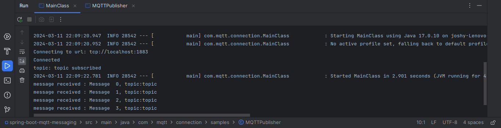
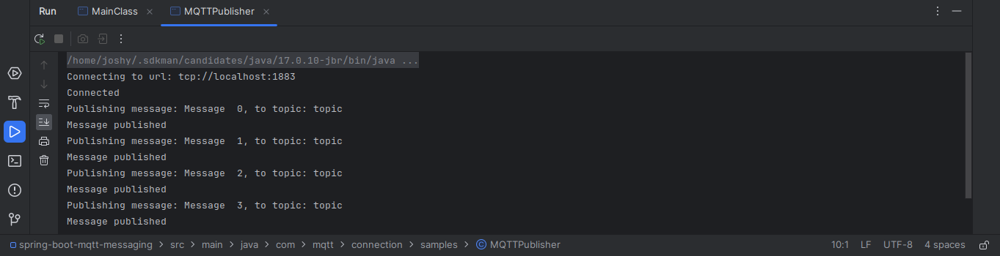

## A pub-sub model application using Apache ActiveMQ
A sample project to create MQTT(Message Queuing Telemetry Transport) messaging  using spring boot and eclipse paho(java client).
apache-activemq-5.18.3 used as a message broker here.

### Working
  There are two main components in this project
  * MQTT publisher
    * 
    * It will keep publishing the messages to a topic in every 3 seconds.
    * Manual start is required.
  * MQTT Subscriber
    * It will subscribe a given topic(in application.properties) when we run the application.
    * The callback method will capture the incoming events and log into the console.

### How to run ???

* Clean and Build the project
  ```
   mvn clean install
  ```
* Make sure that the activeMQ is up and running.
* Run the project
  ```
   Run the `ApplicationMainClass` class.
  ```
* Check the console output.

### Screenshots
| MQTT publisher console logs         | MQTT subscriber console logs                              |
|-------------------------------------|-----------------------------------------------------------|
|  |  |